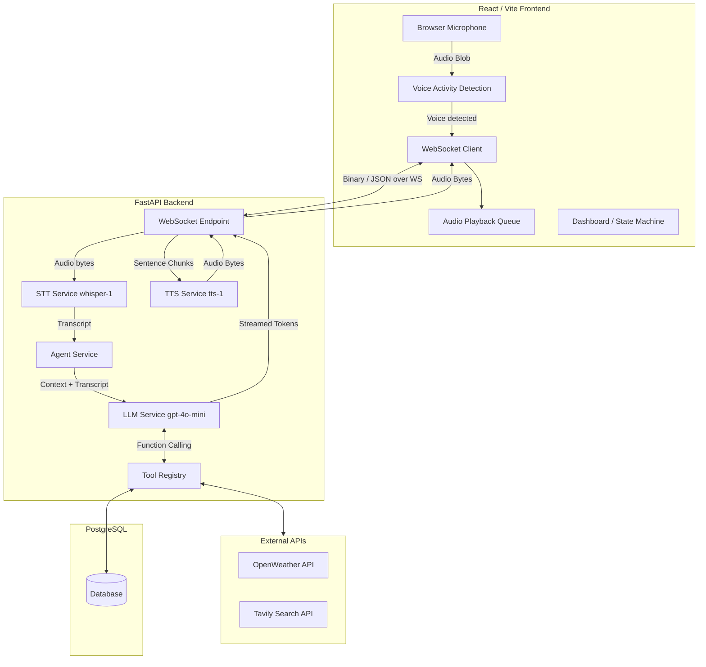

# VoxAI Architecture

VoxAI is a production-grade, real-time AI voice assistant. This document outlines the core architecture and system design.

## High-Level System Flow

## Voice Pipeline & Streaming

The core value of VoxAI lies in its ultra-low latency voice pipeline.

1. **VAD (Voice Activity Detection):** The frontend continuously monitors microphone amplitude using the Web Audio API (`AnalyserNode`). It detects speech and silence (1.5s threshold) locally, reducing unnecessary network traffic.
2. **STT:** Audio blobs are sent over WebSocket to the backend where they are transcribed by OpenAI's Whisper model.
3. **LLM Streaming:** The transcript is passed to GPT-4o-mini with `stream=True`. The backend reads tokens as they are generated.
4. **Sentence Chunking:** The backend uses a regex (`SENTENCE_END_REGEX`) to buffer tokens into complete sentences (ending in `.`, `?`, `!`).
5. **Concurrent TTS:** As soon as a sentence is formed, it is dispatched to the TTS service as an `asyncio.Task`. The backend awaits these tasks sequentially to guarantee correct audio ordering, but the synthesis happens concurrently for subsequent sentences.
6. **Audio Queueing:** The frontend receives audio chunks and pushes them into an `AudioBufferSourceNode` queue, playing them back-to-back for seamless speech.

## True Barge-in (Interruption)

VoxAI supports natural conversation interruptions.

1. **Continuous Listening:** The frontend VAD remains active even while the AI is speaking.
2. **Interruption Trigger:** If the VAD detects user speech while the audio queue is playing, it immediately:
   - Stops the active `AudioBufferSourceNode`.
   - Clears the audio queue.
   - Sends a `{"type": "interrupt"}` JSON message over the WebSocket.
3. **Task Cancellation:** The backend receives the interrupt and calls `.cancel()` on the active `asyncio.Task` processing the pipeline. This kills the LLM generation stream and any pending TTS tasks instantly.
4. **Turn Validation:** To prevent race conditions (e.g., an old audio packet arriving from the network just after an interrupt), the frontend maintains an `activeTurnIdRef`. Incoming audio packets belonging to a cancelled turn are silently dropped.

## Tool Registry

VoxAI uses a modular tool registry (`app/tools/registry.py`) mapping to OpenAI's function calling schema.
The LLM can decide to use:
- **Calculator:** Safe math evaluation.
- **Weather:** Real-time data via OpenWeather.
- **Search:** Current web search via Tavily.
- **Time:** Timezone-aware clock.
- **Notes:** Database-backed session notes.

## Persistence & Auth

The application is backed by PostgreSQL via `SQLAlchemy` (async).
- JWT-based authentication protects the API.
- Users, Conversations, Messages, and ToolCalls are stored persistently.
